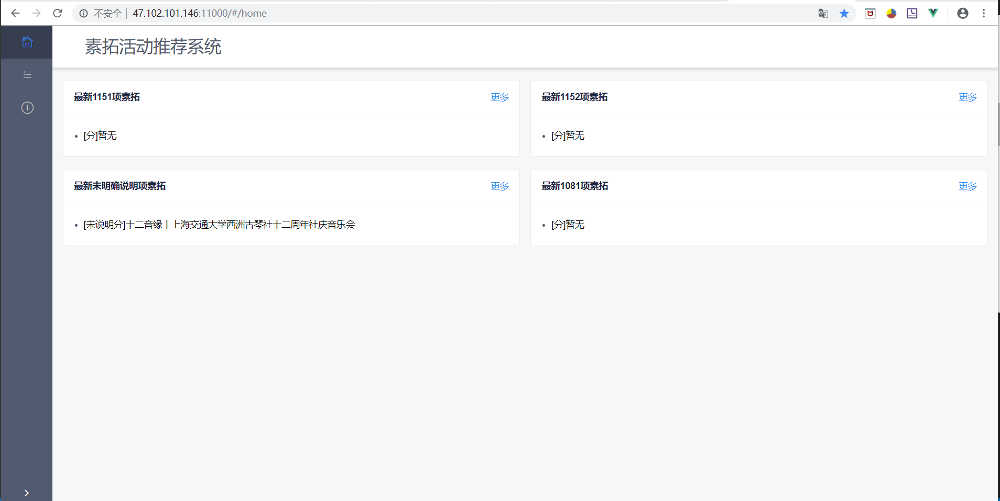
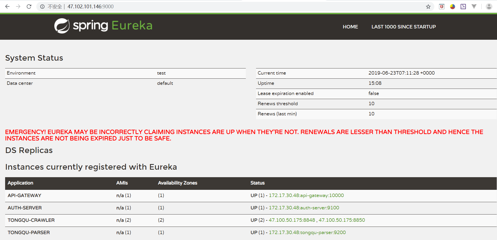

# SE418-Project: Cloud Native

## Basic Information

### Team Members

- Liu Qingyuan（柳清源）
- Zhao Shenglong（赵胜龙）
- Jin Jiazhen（荆家振）
- Dai Fangyue（戴方越）

### Idea

Crawl the data from Tongqu website with web crawler, analyse the content(titles of the activities for example), find out some useful information and demonstrate it on our frontend pages.

### Technique stack

- Spring Boot
- Docker
- Vue
- OAuth
- Jenkins + BlueOcean
- Python + Selenium (For crawler)

### Coding Standard

[Google Java Style Guide](https://google.github.io/styleguide/javaguide.html)

[PEP - Python Style Guide](https://www.python.org/dev/peps/pep-0008/)

## Brief Introduction

### Basic Function

Our project can be seen here:

[素拓活动推荐系统](http://47.102.101.146:11000)


We have only one user so you don't need to input the username and the password. Click "登陆" button and you will see:




We have crawled the data from "tongqu" and parsed it. The page shows the result. Simply click the title of the activity at the home page to jump to the targeting activity page.


### Structure

The microservices of the project are in ./project folder as bellow:


The Eureka page is at http://47.102.101.146:9000/, from which you can see where some of our microservices are deployed:


### Jenkins

Jenkins uses ./project/build.sh,./project/test.sh,./project/deliver.sh,./project/run.sh in sequence to deploy the services. The crawler is deployed on another server.

Username and password of our Jenkins are both admin1.

[Our Jenkins](http://47.102.101.146:8080)


### Microservices

#### TongquCrawler

`TongquCrawler` is a crawler and it crawls `同去网`, fetches json data and stores in MongoDB.

In our project, it plays the role of `Service provider`.

#### TongquParser

`TongquParser` is `service consumer` in our project. Every time the `frontend` fetch activities information from it, it will fetch the raw data from `TongquCrawler` and parse the data and return those contains `素拓`.<br/>
`TongquParser` uses `Ribbon` and `Feign` to balance the server load and simpilify client calls. We also apply histrix in our project and whenever some error happens, the project will run in degrade mode which indicate that the server may not serve well.

#### auth-server

`auth-server` is an `OAuth` server. It protects `TongquParser`. It uses the most simple method to realize the function of `OAuth`. That means what `auth-server` does is just inherits from Template and applies default method.

#### service-discovery & api-gateway

`service-discovery` is a microservice which specially discovers services and manipulate them.<br/>
`api-gateway` is a microservice which unifys common router.

#### Feign

```java
@FeignClient("TONGQU-CRAWLER")
public interface TongquActService {
    @RequestMapping(value = "/getact", method = RequestMethod.GET)
    String getAllActs();
}
```

In that this project is just a simple try using spring cloud, we simply define one method with one provider.

#### Ribbon

```java
@SpringBootApplication
@EnableEurekaClient
@EnableResourceServer
@EnableFeignClients
public class ParserApplication {

	@Bean(value = "restTemplate")
	@LoadBalanced
	RestTemplate restTemplate() {
		return new RestTemplate();
	}

	@Bean
	public IRule iRule() {
		return new RandomRule();
	}


	public static void main(String[] args) {
		SpringApplication.run(ParserApplication.class, args);
	}

}
```

The above code segment is about ribbon. We choose `RandomRule` in our project.<br/>
We also implements our own load balanced rule. See the following code segment

```java
@SpringBootApplication
@EnableEurekaClient
@EnableFeignClients
public class ServiceConsumerApplication {

	@Bean(value = "restTemplate")
	@LoadBalanced
	RestTemplate restTemplate() {
		return new RestTemplate();
	}

	@Bean
	public IRule myOwnIRule() {
		return new WeightedRoundRobinRule();
	}

	public static void main(String[] args) {
		SpringApplication.run(ServiceConsumerApplication.class, args);
	}

}
```

```java
public Server choose(ILoadBalancer lb, Object key) {
        if (this.totalWeight == 0) {
            initialize(lb);
        }
        if (lb == null) {
            log.warn("no load balancer");
            return null;
        }

        if (totalWeight == 0) {
            log.warn("No up servers available from load balancer: " + lb);
        }

        Server server = null;
        int count = 0;
        while (server == null && count++ < 10) {
            List<Server> reachableServers = lb.getReachableServers();
            List<Server> allServers = lb.getAllServers();
            int upCount = reachableServers.size();
            int serverCount = allServers.size();

            if ((upCount == 0) || (serverCount == 0)) {
                log.warn("No up servers available from load balancer: " + lb);
                return null;
            }

            int nextServerIndex = getIndex(incrementAndGetModulo(totalWeight));
            server = allServers.get(nextServerIndex);

            if (server == null) {
                /* Transient. */
                Thread.yield();
                continue;
            }

            if (server.isAlive() && (server.isReadyToServe())) {
                return (server);
            }

            // Next.
            server = null;
        }

        if (count >= 10) {
            log.warn("No available alive servers after 10 tries from load balancer: "
                    + lb);
        }
        return server;
    }
```

The above code is mainly inspired by the implementation of `WeightedResponseTimeRule` written by `stonse` and `RoundRobinRule` written by `stonse` and `Nikos Michalakis`. We combine them together. The reason why we did not apply our own rule is that our own implementation is not so strong and may recur errors.

#### Histrix

We also used `Histrix` in our project.

```java
@SpringBootApplication
@EnableZuulProxy
@EnableCircuitBreaker
public class GatewayApplication {
    @Bean
    protected WebMvcConfigurer corsConfigure() {
        return new WebMvcConfigurer() {
            @Override
            public void addCorsMappings(CorsRegistry registry) {
                registry.addMapping("/**")
                        .allowedHeaders("*")
                        .allowedMethods("*")
                        .allowedOrigins("*");
            }
        };
    }
    public static void main(String[] args) {
        SpringApplication.run(GatewayApplication.class, args);
    }

}

```

```java
@Component
public class MyZuulFallbackProvider implements FallbackProvider {
    @Override
    public String getRoute() {
        return "";
    }

    @Override
    public ClientHttpResponse fallbackResponse(String route, Throwable cause) {
        return new ClientHttpResponse() {
            @Override
            public HttpStatus getStatusCode() throws IOException {
                return HttpStatus.OK;
            }

            @Override
            public int getRawStatusCode() throws IOException {
                return this.getStatusCode().value();
            }

            @Override
            public String getStatusText() throws IOException {
                return this.getStatusCode().getReasonPhrase();
            }

            @Override
            public void close() {
                //...
            }

            @Override
            public InputStream getBody() throws IOException {
                return new ByteArrayInputStream(("cannot provide service for" + route).getBytes());
            }

            @Override
            public HttpHeaders getHeaders() {
                HttpHeaders headers = new HttpHeaders();
                MediaType mediaType = new MediaType("application", "json", Charset.forName("UTF-8"));
                headers.setContentType(mediaType);
                return headers;
            }
        };
    }
}

```

Whenever `TongquParser` can not be accessed, we provide necessary message and run in degrade mode.
