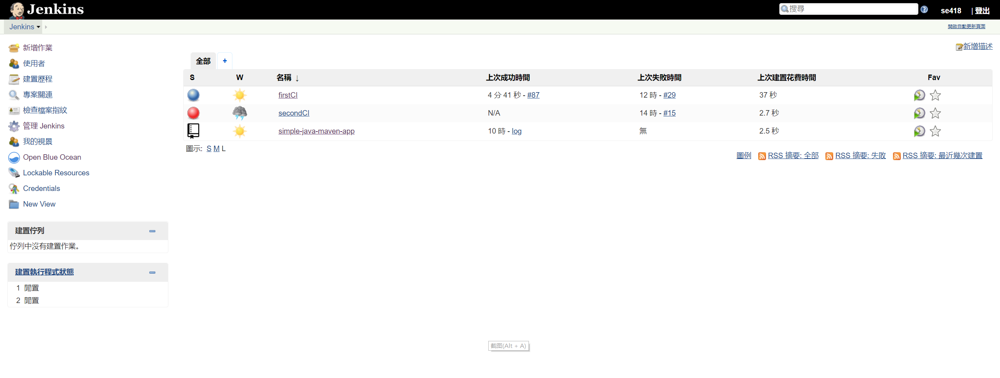
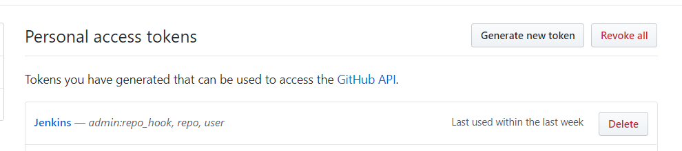
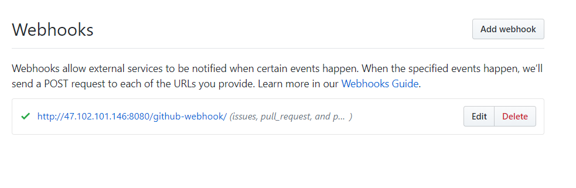
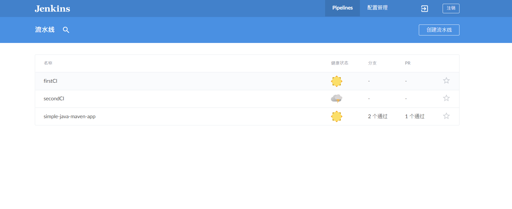
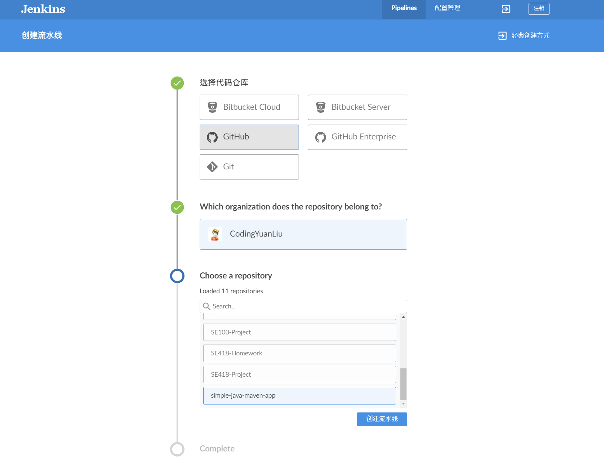
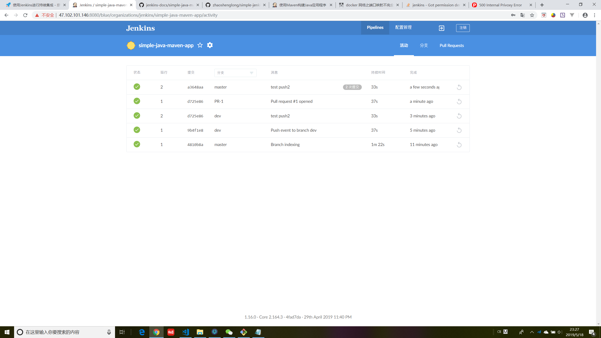
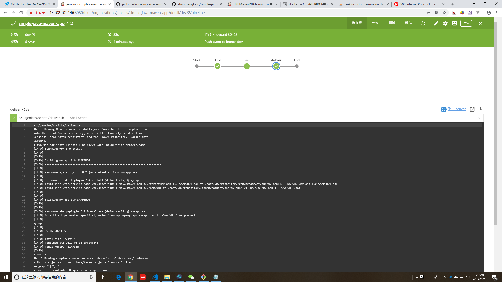
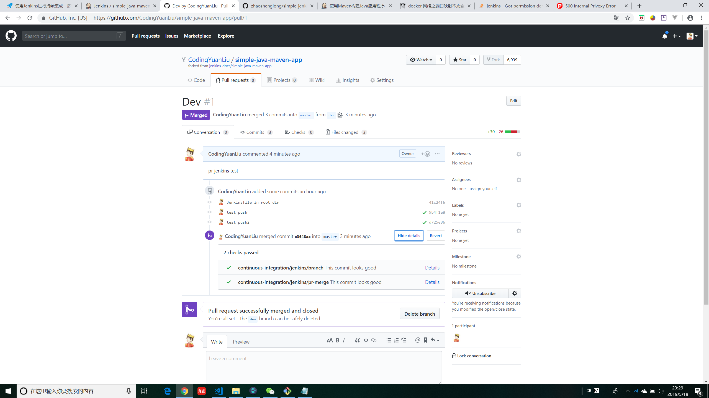

# CI - Jenkins
> We fork a [simple maven hello world object](https://github.com/CodingYuanLiu/simple-java-maven-app) to test our first CI.

## Jenkins Configuration
> Aliyun server (http://47.102.101.146) is used to deploy our Jenkins service.

### Run Jenkins Service with Docker
We run Jenkins with a docker container from the "jenkinsci/blueocean" image, using the following command:
``` bash
docker run \
  --rm \
  -u root \
  -p 8080:8080 \
  -v jenkins-data:/var/jenkins_home \
  -v /var/run/docker.sock:/var/run/docker.sock \
  -v "$HOME":/home \
  jenkinsci/blueocean
```
We are able to see Jenkins running on http://47.102.101.146:8080 then. Configure it and log in as administrator.



### Credential Configuration and Web Hook of Github
Jenkins needs to connect to github repo and watch its behavior (like push, pull request, etc), which means that credential is required. Generate a personal access token for Jenkins and save it. 



Then add a webhook in the repo.



### Create Jenkins Pipeline with Blue Ocean
> Blue Ocean is a virtualized tool for Jenkins.

Click "Open Blue Ocean" on the left of the Jenkins main page, and then click "Create Pipeline" on the top right corner of the page.



Follow the instruction and a pipeline is expected to be created later. We can either write the Jenkinsfile manually or automatically with Blue Ocean.




## The Running CI service

The Jenkins service will be running all the time, here are its role and effect.

Whenever there is a new push to the relevant repo, GitHub will start a new integration of Jenkins through webhook. The commit message will be shown in the chart. See image below: 



If we click on one of them, we will see the interface shown in the following figure. The pipeline stages are graphed at the top of the page. Click any of them will show the details. And, if any error occurs, the information will be shown below.



When finishing the CI process, when we make a pull request, a test will start automately by Jenkins. See picture below.

